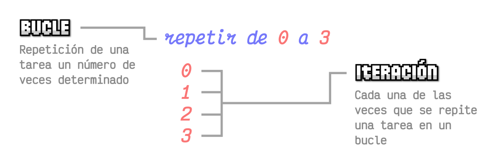

= CHECKPOINT 8

== ¿Qué tipo de bucles hay en JS?

=== Introducción

En programación, los bucles son estructuras fundamentales que permiten ejecutar un bloque de código varias veces. Son esenciales para automatizar tareas repetitivas y son una característica clave en cualquier lenguaje de programación, incluido JavaScript.

=== Conceptos Fundamentales

Antes de explorar los tipos específicos de bucles en JavaScript, es importante comprender algunos conceptos fundamentales:

* **Iteración**: Es el proceso de repetir un conjunto de instrucciones un número específico de veces o hasta que se cumpla una condición.
* **Variable de control**: Es una variable que se utiliza para controlar la ejecución de un bucle. Generalmente se incrementa o decrementa con cada iteración.
* **Condición de salida**: Es la condición que se evalúa antes de cada iteración para determinar si el bucle debe continuar o detenerse.

=== Tipos de Bucles en JavaScript

En JavaScript, existen varios tipos de bucles que se utilizan en diferentes situaciones:

==== 1. Bucle "for"

El bucle "for" es adecuado cuando conoces el número exacto de veces que quieres que se ejecute el bloque de código. Tiene tres partes: inicialización, condición y expresión de iteración.

El formato general es:

[source,javascript]
----
for (inicialización; condición; expresión de iteración) {
  // código a ejecutar
}
----

* La **inicialización** se ejecuta una vez antes de que comience el bucle y generalmente se utiliza para inicializar la variable de control.
* La **condición** se evalúa antes de cada iteración. Si es verdadera, el bucle continúa; de lo contrario, el bucle termina.
* La **expresión de iteración** se ejecuta después de cada iteración y generalmente se utiliza para modificar la variable de control.

Por ejemplo:

[source,javascript]
----
for (let i = 0; i < 5; i++) {
  console.log("Iteración " + i);
}
----

Este bucle imprimirá "Iteración 0", "Iteración 1", "Iteración 2", "Iteración 3" y "Iteración 4" en la consola.

==== 2. Bucle "while"

El bucle "while" se utiliza cuando no sabes cuántas veces se ejecutará el bloque de código, pero se ejecutará mientras se cumpla una condición.

El formato general es:

[source,javascript]
----
while (condición) {
  // código a ejecutar
}
----

Por ejemplo:

[source,javascript]
----
let i = 0;
while (i < 5) {
  console.log("Iteración " + i);
  i++;
}
----

Este bucle imprimirá lo mismo que el ejemplo anterior.

==== 3. Bucle "do...while"

El bucle "do...while" es similar al bucle "while", pero garantiza que el bloque de código se ejecute al menos una vez antes de verificar la condición.

El formato general es:

[source,javascript]
----
do {
  // código a ejecutar
} while (condición);
----

Por ejemplo:

[source,javascript]
----
let i = 0;
do {
  console.log("Iteración " + i);
  i++;
} while (i < 5);
----

Este bucle también imprimirá lo mismo que los ejemplos anteriores.

=== Conclusiones

Los bucles son una parte fundamental de la programación en JavaScript y son esenciales para automatizar tareas repetitivas. Es importante comprender cómo funcionan los diferentes tipos de bucles y cuándo usar cada uno de ellos para escribir un código limpio y eficiente.

=== Referencias

* Guias DevCamp
* https://developer.mozilla.org/es/docs/Web/JavaScript/Guide/Loops_and_iteration
* https://www.freecodecamp.org/espanol/news/javascript-bucles-explicados-for-while-loops/
* https://lenguajejs.com/fundamentos/bucles-e-iteraciones/que-son/

''''

== ¿Cuáles son las diferencias entre const, let y var?

En JavaScript, `const`, `let` y `var` son palabras clave utilizadas para declarar variables. Cada una tiene diferentes comportamientos y se utiliza en diferentes contextos. En esta sección, exploraremos en detalle las diferencias entre ellas.

=== 1. var

`var` fue la forma tradicional de declarar variables en JavaScript antes de la introducción de `const` y `let`. Aunque todavía es ampliamente compatible, tiene algunas limitaciones y no se recomienda su uso en la mayoría de los casos modernos. Algunas de las características de `var` incluyen:

* **Alcance de función**: Las variables declaradas con `var` tienen alcance de función. Esto significa que están disponibles dentro de la función en la que se declaran, incluso si están dentro de un bloque como un bucle o una declaración condicional.

* **Reasignación y redeclaración**: Las variables declaradas con `var` pueden ser reasignadas y redeclaradas en cualquier parte del código.

* **Hoisting**: Las declaraciones `var` son elevadas al inicio de su contexto de ejecución, lo que significa que pueden ser utilizadas antes de ser declaradas en el código.

[source,javascript]
----
// Ejemplo de uso de var
var x = 10;
console.log(x); // Salida: 10

// Reasignación de var
x = 20;
console.log(x); // Salida: 20

// Alcance de var
function exampleVar() {
  if (true) {
    var y = 30;
  }
  console.log(y); // Salida: 30 (ya que var tiene alcance de función)
}
exampleVar();
----

=== 2. let

`let` se introdujo en ECMAScript 6 (también conocido como ES6) y es una forma más moderna y segura de declarar variables en JavaScript. Algunas de las características de `let` incluyen:

* **Alcance de bloque**: Las variables declaradas con `let` tienen alcance de bloque, lo que significa que solo están disponibles dentro del bloque en el que se declaran, como un bucle o una declaración condicional.

* **No permite redeclaración**: No puedes declarar la misma variable más de una vez en el mismo ámbito utilizando `let`. Esto evita errores comunes y hace que el código sea más fácil de entender y depurar.

* **Permite reasignación**: Las variables declaradas con `let` pueden ser reasignadas, lo que significa que su valor puede cambiar después de la declaración inicial.

* **Hoisting**: A diferencia de `var`, las variables declaradas con `let` no son elevadas al principio de su contexto de ejecución. Esto significa que no pueden ser utilizadas antes de su declaración en el código.

[source,javascript]
----
// Ejemplo de uso de let
let a = 5;
console.log(a); // Salida: 5

// Reasignación de let
a = 15;
console.log(a); // Salida: 15

// Alcance de let
function exampleLet() {
  if (true) {
    let b = 25;
    console.log(b); // Salida: 25 (ya que let tiene alcance de bloque)
  }
  // console.log(b); // Error: b no está definido fuera del bloque
}
exampleLet();
----

=== 3. const

`const` también se introdujo en ECMAScript 6 y se utiliza para declarar variables cuyo valor no cambiará después de la declaración inicial. Algunas de las características de `const` incluyen:

* **Constantes**: Las variables declaradas con `const` son constantes, lo que significa que su valor no puede ser reasignado después de la declaración inicial.

* **Alcance de bloque**: Al igual que `let`, las variables declaradas con `const` tienen alcance de bloque y solo están disponibles dentro del bloque en el que se declaran.

* **No permite redeclaración ni reasignación**: No puedes declarar la misma variable más de una vez en el mismo ámbito ni reasignar su valor después de la declaración inicial utilizando `const`.

* **Hoisting**: Al igual que con `let`, las variables declaradas con `const` no son elevadas al principio de su contexto de ejecución y no pueden ser utilizadas antes de su declaración en el código.

[source,javascript]
----
// Ejemplo de uso de const
const PI = 3.14;
console.log(PI); // Salida: 3.14

// Intento de reasignación (esto arrojará un error)
// PI = 3.1416; // Error: la asignación a una variable constante estática está prohibida

// Alcance de const
function exampleConst() {
  const LANGUAGE = "JavaScript";
  console.log(LANGUAGE); // Salida: JavaScript
}
exampleConst();
----

=== Conclusiones

En resumen, `const`, `let`, y `var` son palabras clave utilizadas para declarar variables en JavaScript, cada una con su propio conjunto de características y comportamientos. En la práctica moderna, se recomienda el uso de `const` para valores que no cambian y `let` para variables que pueden cambiar de valor. `var` debe evitarse en la medida de lo posible debido a sus limitaciones y problemas potenciales de alcance.

=== Referencias

* Guias DevCamp
* https://www.freecodecamp.org/espanol/news/javascript-variables-para-principiantes/
* https://www.freecodecamp.org/espanol/news/var-let-y-const-cual-es-la-diferencia/
* https://es.javascript.info/variables

''''

== ¿Qué es una función de flecha?

En JavaScript, las funciones de flecha son una característica introducida en ECMAScript 6 (también conocido como ES6) que proporciona una sintaxis más concisa y una forma más simple de escribir funciones. En esta sección, exploraremos en detalle qué son las funciones de flecha, cómo se utilizan y cuáles son sus diferencias con las funciones tradicionales.

=== Definición

Una función de flecha es una forma abreviada y más compacta de escribir una función en JavaScript. Se llaman "funciones de flecha" debido a la sintaxis de flecha `=>` que se utiliza para definirlas. La sintaxis general de una función de flecha es:

[source,javascript]
----
(parametros) => {
  // cuerpo de la función
}
----

Por ejemplo:

[source,javascript]
----
const sum = (a, b) => {
  return a + b;
};
console.log(sum(2, 3)); // Salida: 5
----

En este ejemplo, `sum` es una función de flecha que toma dos parámetros `a` y `b`, y devuelve su suma.

=== Ventajas

Las funciones de flecha ofrecen varias ventajas sobre las funciones tradicionales:

* **Sintaxis concisa**: La sintaxis de flecha es más corta y clara en comparación con las funciones tradicionales, lo que hace que el código sea más legible y fácil de entender.

* **Enlace léxico (lexical binding)**: Las funciones de flecha no tienen su propio contexto de `this`, lo que significa que heredan el valor de `this` del ámbito circundante. Esto evita problemas comunes con `this` en las funciones tradicionales.

* **No se iza (hoisted)**: A diferencia de las funciones tradicionales, las funciones de flecha no se izan al principio de su contexto de ejecución, lo que significa que no pueden ser utilizadas antes de su declaración en el código.

=== Diferencias con las Funciones Tradicionales

Aunque las funciones de flecha son similares a las funciones tradicionales, existen algunas diferencias importantes:

* **`this`**: En las funciones de flecha, `this` se hereda del ámbito circundante y no puede ser cambiado mediante `bind()`, `call()` o `apply()`, mientras que en las funciones tradicionales `this` depende de cómo se invoca la función.

* **`arguments`**: Las funciones de flecha no tienen su propio objeto `arguments`. Si necesitas acceder a los argumentos de la función, puedes usar la palabra clave `arguments` dentro de una función tradicional.

* **`new`**: Las funciones de flecha no pueden ser utilizadas como constructores y no tienen su propio `prototype`. Intentar utilizar una función de flecha con `new` generará un error.

=== Ejemplos de Uso

[source,javascript]
----
// Ejemplo de una función de flecha
const greet = (name) => {
  return "Hola, " + name + "!";
};
console.log(greet("Juan")); // Salida: Hola, Juan!

// Ejemplo de función de flecha con un solo parámetro y retorno implícito
const square = x => x * x;
console.log(square(5)); // Salida: 25

// Ejemplo de función de flecha sin parámetros
const sayHello = () => {
  return "¡Hola!";
};
console.log(sayHello()); // Salida: ¡Hola!
----

Estos ejemplos ilustran cómo se pueden definir y utilizar funciones de flecha en JavaScript, junto con algunas de sus características y diferencias con las funciones tradicionales.

=== Referencias

* Guias DevCamp
* https://developer.mozilla.org/es/docs/Web/JavaScript/Reference/Functions/Arrow_functions
* https://www.freecodecamp.org/espanol/news/cuando-y-por-que-debes-usar-las-funciones-flecha-de-es6-y-cuando-no/
* https://es.javascript.info/arrow-functions

''''

== ¿Qué es la deconstrucción de variables?

La deconstrucción de variables es una característica introducida en ECMAScript 6 (también conocido como ES6) que proporciona una forma conveniente de extraer valores de objetos y arrays y asignarlos a variables individuales. En esta sección, exploraremos en detalle qué es la deconstrucción de variables, cómo se utiliza y algunos casos de uso comunes.

=== Definición

La deconstrucción de variables permite extraer valores de objetos y arrays y asignarlos a variables individuales en una sola declaración. La sintaxis de la deconstrucción de variables depende del tipo de dato que estés utilizando: objetos o arrays.

Para objetos, la sintaxis es:

[source,javascript]
----
const { propiedad1, propiedad2 } = objeto;
----

Para arrays, la sintaxis es:

[source,javascript]
----
const [ elemento1, elemento2 ] = array;
----

Por ejemplo:

[source,javascript]
----
const persona = { nombre: "Juan", edad: 30 };
const { nombre, edad } = persona;
console.log(nombre); // Salida: Juan
console.log(edad); // Salida: 30

const numeros = [1, 2, 3, 4, 5];
const [primero, segundo, tercero, cuarto, quinto] = numeros;
console.log(primero); // Salida: 1
console.log(segundo); // Salida: 2
console.log(cuarto); // Salida: 4
----

En estos ejemplos, estamos extrayendo las propiedades `nombre` y `edad` del objeto `persona`, y los elementos `primero`, `segundo` y `cuarto` del array `numeros`, asignándolos a variables individuales.

=== Ventajas

La deconstrucción de variables ofrece varias ventajas:

* **Sintaxis concisa**: Permite extraer valores de objetos y arrays de una manera más clara y concisa, lo que hace que el código sea más legible y fácil de entender.

* **Asignación simultánea**: Permite asignar múltiples valores a múltiples variables en una sola declaración, lo que puede hacer que el código sea más eficiente y fácil de mantener.

* **Renombramiento**: Puedes asignar un nombre diferente a las variables extraídas, lo que puede ser útil para evitar conflictos de nombres o hacer el código más descriptivo.

=== Casos de Uso Comunes

Algunos casos de uso comunes de la deconstrucción de variables incluyen:

* **Desestructuración de parámetros de funciones**: Puedes utilizar la deconstrucción de variables para desestructurar los parámetros de una función, lo que hace que sea más fácil trabajar con objetos complejos.

* **Iteración sobre arrays**: Puedes utilizar la deconstrucción de variables en combinación con bucles para acceder a los elementos de un array de manera más clara y concisa.

* **Extracción de valores de objetos**: Puedes extraer valores específicos de un objeto y asignarlos a variables individuales para facilitar su acceso y manipulación.

=== Ejemplos de Uso

[source,javascript]
----
// Desestructuración de parámetros de funciones
const imprimirPersona = ({ nombre, edad }) => {
  console.log(`Nombre: ${nombre}, Edad: ${edad}`);
};
const persona = { nombre: "Ana", edad: 25 };
imprimirPersona(persona); // Salida: Nombre: Ana, Edad: 25

// Iteración sobre arrays
const colores = ["rojo", "verde", "azul"];
for (const color of colores) {
  console.log(color);
}
// Salida:
// rojo
// verde
// azul

// Extracción de valores de objetos
const estudiante = { nombre: "Pedro", edad: 22, carrera: "Informática" };
const { nombre, carrera } = estudiante;
console.log(nombre); // Salida: Pedro
console.log(carrera); // Salida: Informática
----

Estos ejemplos ilustran cómo se puede utilizar la deconstrucción de variables en JavaScript para extraer valores de objetos y arrays, asignarlos a variables individuales y utilizarlos en diferentes situaciones.

=== Referencias

* Guias DevCamp
* https://developer.mozilla.org/es/docs/Web/JavaScript/Reference/Operators/Destructuring_assignment
* https://www.freecodecamp.org/espanol/news/desestructuracion-de-arreglos-y-objetos-en-javascript/
* https://lenguajejs.com/javascript/objetos/desestructuracion-objetos/

''''

== ¿Qué hace el operador de extensión en JS?

El operador de extensión, también conocido como operador de propagación (`...`), es una característica introducida en ECMAScript 6 (también conocido como ES6) que permite expandir expresiones en lugares donde se esperan múltiples argumentos (para funciones) o múltiples elementos (para arrays). En esta sección, exploraremos en detalle qué hace el operador de extensión, cómo se utiliza y algunos casos de uso comunes.

=== Funcionamiento

El operador de extensión permite expandir una expresión en múltiples elementos individuales. La sintaxis del operador de extensión es simplemente tres puntos seguidos de la expresión que deseas expandir.

Para arrays:

[source,javascript]
----
const array1 = [1, 2, 3];
const array2 = [...array1, 4, 5, 6];
console.log(array2); // Salida: [1, 2, 3, 4, 5, 6]
----

Para objetos:

[source,javascript]
----
const objeto1 = { a: 1, b: 2 };
const objeto2 = { ...objeto1, c: 3, d: 4 };
console.log(objeto2); // Salida: { a: 1, b: 2, c: 3, d: 4 }
----

En estos ejemplos, el operador de extensión `...` se utiliza para expandir el array o `array1` y el objeto `objeto1`, agregando nuevos elementos al final de cada uno.

=== Ventajas

El operador de extensión ofrece varias ventajas:

* **Sintaxis concisa**: Permite combinar y extender arrays y objetos de una manera más concisa y legible, lo que hace que el código sea más fácil de entender y mantener.

* **Inmutabilidad**: Al expandir arrays y objetos, el operador de extensión crea nuevas instancias, lo que garantiza que los datos originales permanezcan intactos y no sean modificados.

* **Flexibilidad**: Puedes utilizar el operador de extensión en una variedad de situaciones, como agregar elementos a arrays, fusionar objetos o pasar múltiples argumentos a funciones.

=== Casos de Uso Comunes

Algunos casos de uso comunes del operador de extensión incluyen:

* **Concatenación de arrays**: Puedes utilizar el operador de extensión para combinar o concatenar arrays de una manera más limpia y concisa.

* **Fusión de objetos**: Puedes utilizar el operador de extensión para combinar las propiedades de múltiples objetos en uno solo, creando un nuevo objeto que contenga todas las propiedades.

* **Pasando múltiples argumentos a funciones**: Puedes utilizar el operador de extensión para pasar múltiples argumentos a funciones que esperan una lista de argumentos separados por comas.

=== Ejemplos de Uso

[source,javascript]
----
// Concatenación de arrays
const numeros1 = [1, 2, 3];
const numeros2 = [4, 5, 6];
const numerosConcatenados = [...numeros1, ...numeros2];
console.log(numerosConcatenados); // Salida: [1, 2, 3, 4, 5, 6]

// Fusión de objetos
const objeto1 = { a: 1, b: 2 };
const objeto2 = { c: 3, d: 4 };
const objetoFusionado = { ...objeto1, ...objeto2 };
console.log(objetoFusionado); // Salida: { a: 1, b: 2, c: 3, d: 4 }

// Pasando múltiples argumentos a una función
const sumar = (a, b, c) => {
  return a + b + c;
};
const numeros = [1, 2, 3];
console.log(sumar(...numeros)); // Salida: 6
----

Estos ejemplos ilustran cómo se puede utilizar el operador de extensión en JavaScript para expandir arrays y objetos, fusionar propiedades y pasar múltiples argumentos a funciones de una manera más concisa y flexible.

=== Referencias

* Guias DevCamp
* https://developer.mozilla.org/es/docs/Web/JavaScript/Reference/Operators/Spread_syntax
* https://developer.mozilla.org/es/docs/Web/JavaScript/Guide/Expressions_and_Operators
* https://developer.mozilla.org/es/docs/Web/JavaScript/Reference/Operators/Optional_chaining

''''

== ¿Qué es la programación orientada a objetos?

La Programación Orientada a Objetos (POO) es un paradigma de programación que se basa en el concepto de "objetos", los cuales son entidades que pueden tener datos en forma de campos (también conocidos como atributos o propiedades) y procedimientos en forma de funciones (también conocidos como métodos). En esta sección, exploraremos en detalle qué es la POO, sus principios fundamentales y cómo se implementa en JavaScript y otros lenguajes de programación.

=== Principios Fundamentales

La POO se basa en cuatro principios fundamentales:

* **Abstracción**: La abstracción consiste en identificar las características esenciales de un objeto y omitir los detalles irrelevantes. Permite modelar objetos del mundo real de manera más efectiva en el código.

* **Encapsulamiento**: El encapsulamiento consiste en ocultar los detalles internos de un objeto y exponer solo las interfaces necesarias para interactuar con él. Proporciona una capa de protección y facilita el mantenimiento y la modificación del código.

* **Herencia**: La herencia permite crear nuevas clases (objetos) basadas en clases existentes, heredando sus propiedades y métodos. Promueve la reutilización de código y la creación de jerarquías de objetos.

* **Polimorfismo**: El polimorfismo permite que un objeto pueda comportarse de diferentes maneras según el contexto. Permite escribir código que funcione con objetos de diferentes tipos sin necesidad de conocer sus detalles internos.

=== Implementación en JavaScript

Aunque JavaScript no es un lenguaje orientado a objetos puro como Java o C++, soporta conceptos de POO a través de su sistema de prototipos y la introducción de clases en ECMAScript 6 (ES6). En JavaScript, los objetos pueden ser creados de varias formas, ya sea utilizando funciones constructoras, clases o directamente con la sintaxis de objetos literales.

Por ejemplo:

[source,javascript]
----
// Definición de una clase en JavaScript (ES6)
class Persona {
  constructor(nombre, edad) {
    this.nombre = nombre;
    this.edad = edad;
  }

  saludar() {
    console.log(`¡Hola, soy ${this.nombre} y tengo ${this.edad} años!`);
  }
}

// Creación de un objeto Persona
const persona1 = new Persona("Ana", 30);
persona1.saludar(); // Salida: ¡Hola, soy Ana y tengo 30 años!
----

En este ejemplo, `Persona` es una clase que define la estructura y el comportamiento de un objeto persona. Se utiliza el constructor para inicializar las propiedades `nombre` y `edad`, y se define el método `saludar` para mostrar un saludo con los datos de la persona.

=== Casos de Uso Comunes

La POO se utiliza en una amplia variedad de aplicaciones y escenarios, incluyendo:

* Desarrollo de software de gran escala: La POO proporciona una forma estructurada y modular de organizar y gestionar código en proyectos grandes y complejos.

* Desarrollo de interfaces de usuario: La POO permite modelar elementos de la interfaz de usuario (como botones, formularios y ventanas) como objetos con propiedades y métodos específicos.

* Desarrollo de videojuegos: La POO es ampliamente utilizada en el desarrollo de videojuegos para modelar personajes, enemigos, objetos y otros elementos del juego como objetos con comportamientos específicos.

=== Conclusiones

La Programación Orientada a Objetos (POO) es un paradigma de programación poderoso que se basa en el concepto de objetos y proporciona una forma estructurada y modular de escribir código. Al entender los principios fundamentales de la POO y cómo se implementan en lenguajes como JavaScript, los programadores pueden crear aplicaciones más organizadas, mantenibles y escalables.

=== Referencias

* Guias DevCamp
* https://developer.mozilla.org/en-US/docs/Learn/JavaScript/Objects/Object-oriented_programming
* https://www.freecodecamp.org/news/object-oriented-programming-javascript/
* https://developer.mozilla.org/en-US/docs/Learn/JavaScript/Objects/Classes_in_JavaScript

''''

== ¿Qué es una promesa en JS?

Una promesa en JavaScript es un objeto que representa el resultado de una operación asíncrona. Proporciona una forma más limpia y eficiente de manejar el código asíncrono en comparación con los callbacks anidados, lo que hace que el código sea más legible y fácil de entender. En esta sección, exploraremos en detalle qué es una promesa, cómo se utiliza y algunos casos de uso comunes.

image::images/promises.png[Promesas]

=== Definición

Una promesa es un objeto que puede estar en uno de tres estados: pendiente (pending), resuelta (fulfilled) o rechazada (rejected). Cuando se crea una promesa, se ejecuta una función asincrónica y se devuelve una promesa que representa el resultado de esa función.

La sintaxis básica de una promesa es:

[source,javascript]
----
const miPromesa = new Promise((resolve, reject) => {
  // Código asíncrono
  if (/* operación exitosa */) {
    resolve(resultado); // Resuelve la promesa con el resultado
  } else {
    reject(error); // Rechaza la promesa con el error
  }
});
----

Por ejemplo:

[source,javascript]
----
const miPromesa = new Promise((resolve, reject) => {
  setTimeout(() => {
    resolve("Operación exitosa");
  }, 1000);
});
----

En este ejemplo, se crea una promesa que se resolverá después de 1 segundo con el mensaje "Operación exitosa".

=== Estados de una Promesa

* **Pendiente (pending)**: Estado inicial de una promesa, antes de que se resuelva o se rechace.
* **Resuelta (fulfilled)**: Estado en el que una promesa se ha resuelto satisfactoriamente con un valor.
* **Rechazada (rejected)**: Estado en el que una promesa ha sido rechazada con un error.

=== Métodos de una Promesa

Las promesas en JavaScript proporcionan varios métodos para interactuar con ellas:

* **then()**: Se utiliza para manejar el caso en que una promesa se resuelve correctamente.
* **catch()**: Se utiliza para manejar el caso en que una promesa es rechazada.
* **finally()**: Se ejecuta siempre, independientemente de si la promesa se resuelve o se rechaza.

Por ejemplo:

[source,javascript]
----
miPromesa
  .then((resultado) => {
    console.log(resultado);
  })
  .catch((error) => {
    console.error(error);
  })
  .finally(() => {
    console.log("Operación completada");
  });
----

En este ejemplo, utilizamos `then()` para manejar el caso en que la promesa se resuelve correctamente, `catch()` para manejar el caso en que la promesa es rechazada y `finally()` para ejecutar código después de que la promesa se resuelva o se rechace.

=== Casos de Uso Comunes

Algunos casos de uso comunes de las promesas incluyen:

* **Solicitud de datos a un servidor**: Las promesas son ampliamente utilizadas para realizar solicitudes HTTP asíncronas a servidores y manejar las respuestas de manera eficiente.
* **Carga de archivos o recursos externos**: Las promesas son útiles para cargar archivos o recursos externos de forma asíncrona y manejarlos una vez que estén disponibles.
* **Operaciones de temporización**: Las promesas son útiles para realizar operaciones que requieren un tiempo de espera, como esperar a que se complete una animación o una transición antes de ejecutar otro código.

=== Ejemplos de Uso

[source,javascript]
----
// Ejemplo de solicitud HTTP con promesas
const obtenerDatos = () => {
  return new Promise((resolve, reject) => {
    fetch("https://ejemplo.com/api/datos")
      .then(response => response.json())
      .then(data => resolve(data))
      .catch(error => reject(error));
  });
};

obtenerDatos()
  .then(data => {
    console.log(data);
  })
  .catch(error => {
    console.error(error);
  });
----

En este ejemplo, utilizamos una promesa para realizar una solicitud HTTP asíncrona a una API y manejar la respuesta de manera eficiente.

=== Conclusiones

Las promesas en JavaScript proporcionan una forma más limpia y eficiente de manejar el código asíncrono, evitando los problemas asociados con los callbacks anidados. Al entender cómo funcionan las promesas y cómo se utilizan, los desarrolladores pueden escribir código más legible, mantenible y escalable.

=== Referencias

* Guias DevCamp
* https://developer.mozilla.org/es/docs/Web/JavaScript/Guide/Using_promises
* https://developer.mozilla.org/es/docs/Web/JavaScript/Reference/Global_Objects/Promise
* https://es.javascript.info/promise-basics

''''

== ¿Qué hacen async y await por nosotros?

`async` y `await` son características introducidas en ECMAScript 2017 (también conocido como ES8) que proporcionan una forma más limpia y legible de trabajar con código asíncrono basado en promesas. En esta sección, exploraremos qué son `async` y `await`, cómo se utilizan y algunos casos de uso comunes.

=== Definición

`async` es una palabra clave que se utiliza para declarar que una función devuelve una promesa. Cuando se llama a una función `async`, esta siempre devuelve una promesa. Dentro de una función `async`, se pueden utilizar expresiones `await` para esperar que una promesa se resuelva antes de continuar con la ejecución del código.

La sintaxis básica de `async` y `await` es la siguiente:

[source,javascript]
----
async function miFuncion() {
  const resultado = await promesa;
  return resultado;
}
----

Por ejemplo:

[source,javascript]
----
async function obtenerDatos() {
  const response = await fetch("https://ejemplo.com/api/datos");
  const data = await response.json();
  return data;
}
----

En este ejemplo, la función `obtenerDatos` es una función `async` que espera que se resuelva la promesa devuelta por `fetch`, y luego espera que se resuelva la promesa devuelta por `response.json()`.

=== Ventajas

`async` y `await` ofrecen varias ventajas:

* **Sintaxis concisa y legible**: Permite escribir código asíncrono de una manera más similar al código síncrono, lo que hace que sea más fácil de entender y mantener.

* **Manejo de errores**: Permite utilizar bloques `try/catch` para manejar errores de manera similar al código síncrono, lo que facilita el manejo de excepciones en código asíncrono.

* **Evita el infierno de los callbacks**: Evita el problema del "callback hell" (infierno de los callbacks) asociado con los callbacks anidados, haciendo que el código sea más limpio y estructurado.

=== Casos de Uso Comunes

Algunos casos de uso comunes de `async` y `await` incluyen:

* **Solicitudes HTTP asíncronas**: `async` y `await` son ampliamente utilizados para realizar solicitudes HTTP asíncronas a servidores y manejar las respuestas de manera eficiente.

* **Operaciones de lectura/escritura de archivos**: `async` y `await` son útiles para realizar operaciones de lectura/escritura de archivos de manera asíncrona y manejar los resultados de manera eficiente.

* **Operaciones de temporización**: `async` y `await` son útiles para realizar operaciones que requieren un tiempo de espera, como esperar a que se complete una animación o una transición antes de ejecutar otro código.

=== Ejemplos de Uso

[source,javascript]
----
// Ejemplo de solicitud HTTP con async/await
async function obtenerDatos() {
  try {
    const response = await fetch("https://ejemplo.com/api/datos");
    const data = await response.json();
    return data;
  } catch (error) {
    console.error(error);
    throw new Error("Error al obtener los datos");
  }
}

(async () => {
  try {
    const datos = await obtenerDatos();
    console.log(datos);
  } catch (error) {
    console.error(error.message);
  }
})();
----

En este ejemplo, utilizamos `async` y `await` para realizar una solicitud HTTP asíncrona a una API y manejar la respuesta de manera eficiente.

=== Conclusiones

`async` y `await` son características poderosas que proporcionan una forma más limpia y legible de trabajar con código asíncrono en JavaScript. Al entender cómo funcionan `async` y `await` y cómo se utilizan, los desarrolladores pueden escribir código más organizado, mantenible y escalable.

=== Referencias

* Guias DevCamp
* https://developer.mozilla.org/en-US/docs/Web/JavaScript/Reference/Statements/async_function
* https://es.javascript.info/async-await
* https://developer.mozilla.org/en-US/docs/Web/JavaScript/Reference/Operators/await
